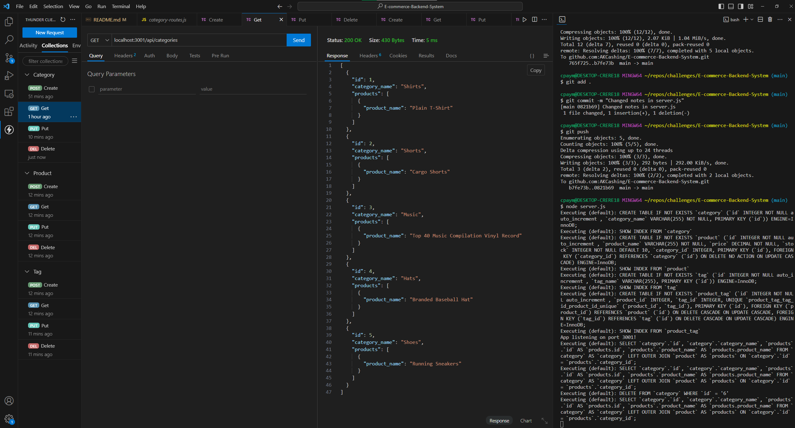

# E-commerce-Backend-System

## Description
E-Commerce Backend System is repository involving starter code and filling in missing code inside the models folder and routes/api folders. I had to fill in the code designed to Get, Post, Put, and Delete a Category, Product, and Tag of an item added to the system.

## Link to Video Walkthrough
